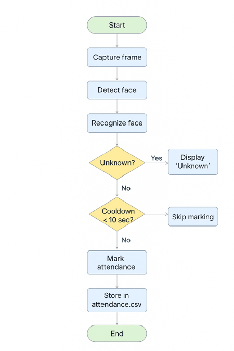

# Face Recognition Attendance System

This project is an **Automated Attendance System** using Face Recognition.  
It captures faces, recognizes them, and marks attendance in a CSV file.  
Built with **OpenCV (Haar Cascade + Eigenfaces/MSE)** in C++.

---

## 📌 Methodology (Flow)
1. **Initialization**
2. **Face Detection and Capture**
3. **Face Recognition**
4. **Attendance Marking**
5. **Viewing Attendance**
6. **Termination**

---

## 📂 Features
- Detects multiple faces from webcam feed.
- Recognizes faces using trained data.
- Marks attendance with **name + timestamp**.
- Prevents duplicate attendance per day.
- CSV-based attendance storage.
- Console + On-screen messages for status.

---

## 🛠️ Technologies Used
- **C++**
- **OpenCV**
- **Haar Cascade Classifier**
- **Eigenfaces + MSE for Recognition**
- **CSV for attendance logs**

---

## 👨‍💻 Authors
Made by **Electronics, Communication, and Information Engineering** students:

- Krishna Kandel — THA081BEI014  
- Nishanta Poudel — THA081BEI025  
- Pranish Pokhrel — THA081BEI029  
- Prateek Chaulagain — THA081BEI030  

---

## 🚀 Future Improvements
- Add deep learning-based recognition (CNN/DNN).  
- Improve accuracy under different lighting.  
- Cloud storage for attendance logs.  
- Web dashboard for real-time attendance.  
- Mobile app integration.  

---

## 📖 How to Run
1. Clone the repository.  
2. Place training images inside the dataset folder.  
3. Build using CMake with OpenCV.  
4. Run the executable to start webcam-based attendance.  

